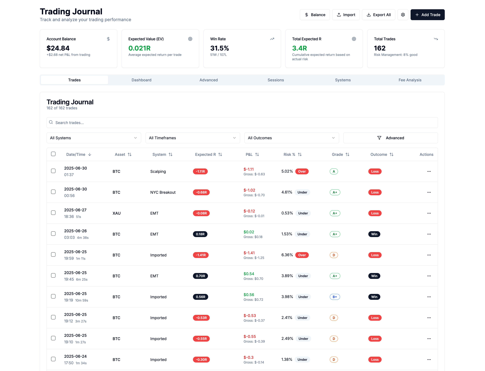

# 📊 Advanced Trading Journal

A comprehensive, feature-rich trading journal application built with Next.js, TypeScript, and Tailwind CSS. Track, analyze, and improve your trading performance with advanced analytics, risk management tools, and detailed reporting.



## ✨ Features

### 🎯 Core Trading Features
- **Trade Entry & Management**: Add, edit, and delete trades with comprehensive details
- **Risk Management**: Calculate ideal stop losses, risk amounts, and position sizing
- **Expected R Analysis**: Track performance using R-multiples and expected value
- **Real-time Calculations**: Automatic P&L, fee, and risk metric calculations
- **Trade Grading System**: Grade trades from A++++ to F for performance tracking

### 📈 Advanced Analytics
- **Performance Dashboard**: Win rate, P&L, Sharpe ratio, and drawdown analysis
- **System Performance**: Compare different trading systems and strategies
- **Session Analysis**: Track performance across different trading sessions
- **Day-of-Week Analysis**: Identify your best and worst trading days
- **Fee Impact Analysis**: Monitor how fees affect your profitability
- **Risk Deviation Tracking**: Identify over-risked and under-risked positions

### 🔧 Data Management
- **CSV Import**: Import trades from broker statements with automatic parsing
- **JSON Export/Import**: Full data backup and restore functionality
- **Bulk Operations**: Update multiple trades simultaneously
- **Advanced Filtering**: Filter trades by system, timeframe, grade, session, and more
- **Duplicate Detection**: Prevent duplicate trade entries based on ticket numbers

### ⚙️ Customization
- **Trading Systems**: Configure your own trading strategies and systems
- **Asset Fees**: Set custom fee structures for different assets
- **Trading Sessions**: Define custom trading sessions with time zones
- **Risk Settings**: Configure risk tolerance and ideal risk amounts per system
- **Account Balance Tracking**: Track balance changes and adjustments

## 🚀 Getting Started

### Prerequisites
- Node.js 18+ 
- npm or yarn package manager

### Installation

1. **Clone the repository**
```bash
   git clone https://github.com/...
   cd trading-journal
```

2. **Install dependencies**
```bash
   npm install
   # or
   yarn install
```

3. **Run the development server**
```bash
   npm run dev
   # or
   yarn dev
```

4. **Open your browser**
   Navigate to [http://localhost:3000](http://localhost:3000)

## 📱 Usage Guide

### Adding Your First Trade

1. Click the **"Add Trade"** button
2. Fill in the basic trade information:
   - Date and time
   - Asset (BTC, ETH, etc.)
   - Trade type (Long/Short)
   - Entry, stop loss, and exit prices
   - Position size

3. The system automatically calculates:
   - Risk amount and percentage
   - Expected R-multiple
   - P&L and fees
   - Risk deviation from ideal

### Importing Trades from Broker

1. Go to **Import** → **CSV Import (Broker)**
2. Set your default ideal risk amount
3. Upload your broker's CSV file or paste the data
4. Review the preview and click **Import**

#### Supported Brokers For CSV Import
- Exness.com

**Supported CSV Format:**
```csv
symbol,type,opening_time_utc,closing_time_utc,lots,opening_price,closing_price,stop_loss,take_profit,profit_usd,commission_usd,close_reason,ticket
BTCUSD,buy,2024-01-15 10:30:00,2024-01-15 14:45:00,0.1,50000,51000,49500,52000,100,-5,tp,12345
```

### Using Advanced Analytics

Navigate to the **Analytics** tab to access:

- **Performance Overview**: Key metrics and charts
- **System Comparison**: Compare different trading strategies
- **Risk Analysis**: Identify patterns in your risk management
- **Time-based Analysis**: Performance by session and day of week

### Setting Up Your Configuration

1. Click **Settings** to configure:
   - Account balance
   - Asset fees (per lot)
   - Trading systems/strategies
   - Risk tolerance settings
   - Trading sessions and time zones

2. **System-Specific Risk**: Set different ideal risk amounts for each trading system

## 📊 Key Metrics Explained

### Expected R (Expected Return)
- Measures performance relative to your ideal risk amount
- Formula: `Profit / Ideal Risk Amount`
- Positive values indicate profitable trades relative to your risk target

### Risk Deviation
- Shows how much your actual risk differs from your ideal risk
- Formula: `((Actual Risk - Ideal Risk) / Ideal Risk) × 100`
- Helps identify over-risked and under-risked positions

### Sharpe Ratio
- Risk-adjusted return measure
- Higher values indicate better risk-adjusted performance
- Calculated using Expected R values

### Maximum Drawdown
- Largest peak-to-trough decline in your account
- Important for understanding worst-case scenarios

## 🔧 Technical Details

### Built With
- **Framework**: Next.js 15 with App Router
- **Language**: TypeScript
- **Styling**: Tailwind CSS
- **UI Components**: shadcn/ui
- **Charts**: Recharts
- **Icons**: Lucide React
- **Data Storage**: Browser localStorage (client-side)

### Project Structure
```
├── app/                    # Next.js app directory
├── components/            # React components
│   ├── ui/               # shadcn/ui components
│   ├── trade-form/       # Trade entry form components
│   └── ...               # Feature-specific components
├── types/                # TypeScript type definitions
├── utils/                # Utility functions
└── README.md
```

### Key Components
- **TradeEntryForm**: Comprehensive trade input with validation
- **TradesList**: Sortable, filterable trade table with bulk operations
- **AnalyticsDashboard**: Performance metrics and visualizations
- **AdvancedAnalytics**: Deep-dive analysis tools
- **ImportDialog**: CSV/JSON import functionality
- **SettingsPanel**: Configuration management

## 📈 Advanced Features

### Risk Management System
- **Ideal Stop Loss Calculation**: Automatically calculates optimal stop losses based on your risk settings
- **Position Sizing**: Ensures consistent risk across all trades
- **Risk Status Indicators**: Visual alerts for over-risked and under-risked positions

### Performance Tracking
- **R-Multiple Analysis**: Track performance in risk-adjusted terms
- **System Performance**: Compare the effectiveness of different trading strategies
- **Session Analysis**: Identify your most profitable trading times
- **Consecutive Win/Loss Tracking**: Monitor streaks and psychological patterns

### Data Import/Export
- **Broker Integration**: Import trades directly from popular broker CSV formats
- **Backup & Restore**: Full JSON export/import for data portability
- **Duplicate Prevention**: Automatic detection of duplicate trades by ticket number

## 🎨 Customization

### Adding New Trading Systems
1. Go to Settings → Trading Systems
2. Add your system name
3. Set system-specific ideal risk amounts
4. Configure system-specific analysis parameters

### Custom Asset Fees
1. Navigate to Settings → Asset Fees
2. Add your assets and their respective fees per lot
3. Fees are automatically calculated for all trades

### Trading Sessions
1. Configure your trading sessions in Settings
2. Set start/end times and time zones
3. Track performance across different market sessions

## 🔒 Data Privacy

- **Local Storage**: All data is stored locally in your browser
- **No Server**: No data is sent to external servers
- **Export Control**: You control all data exports and backups
- **Privacy First**: Your trading data remains completely private

## 🤝 Contributing

Contributions are welcome! Please feel free to submit a Pull Request.

### Development Setup
1. Fork the repository
2. Create a feature branch: `git checkout -b feature/amazing-feature`
3. Commit your changes: `git commit -m 'Add amazing feature'`
4. Push to the branch: `git push origin feature/amazing-feature`
5. Open a Pull Request

### Coding Standards
- Use TypeScript for all new code
- Follow the existing component structure
- Add proper error handling and loading states
- Include JSDoc comments for complex functions

## 📝 License

This project is licensed under the MIT License - see the [LICENSE](LICENSE) file for details.

## 🙏 Acknowledgments

- [Next.js](https://nextjs.org/) - The React framework for production
- [shadcn/ui](https://ui.shadcn.com/) - Beautiful and accessible UI components
- [Tailwind CSS](https://tailwindcss.com/) - Utility-first CSS framework
- [Recharts](https://recharts.org/) - Composable charting library
- [Lucide](https://lucide.dev/) - Beautiful & consistent icon toolkit

## 📞 Support

If you encounter any issues or have questions:

1. Check the [Issues](https://github.com/yourusername/trading-journal/issues) page
2. Create a new issue with detailed information
3. Include screenshots and error messages when applicable

## 🗺️ Roadmap

### Upcoming Features
- [ ] Mobile app version
- [ ] Cloud sync capabilities
- [ ] Advanced backtesting tools
- [ ] Integration with more brokers
- [ ] Machine learning performance predictions
- [ ] Social trading features
- [ ] Advanced portfolio analytics
- [ ] Tax reporting tools

---

**Happy Trading! 📈**

*Remember: Past performance does not guarantee future results. Always trade responsibly and never risk more than you can afford to lose.*
